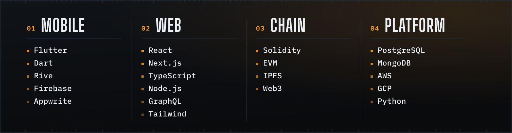

  <picture>
    <source media="(prefers-color-scheme: dark)" srcset="assets/hero-dark.svg">
    <source media="(prefers-color-scheme: light)" srcset="assets/hero-light.svg">
    
  </picture>

  
  
  
  

---

I build web and mobile products — mostly **Flutter** on the front, **TypeScript** and **Node** behind it — with a long-running interest in what decentralised systems are genuinely good for rather than what they're marketed as.

Right now I'm heads-down on **BeFit AI**, an iPhone fitness app.

 

## `01` — Stack

<picture>
  <source media="(prefers-color-scheme: dark)" srcset="assets/stack-dark.svg">
  <source media="(prefers-color-scheme: light)" srcset="assets/stack-light.svg">
  
</picture>

 

## `02` — Selected work

### SpaceWalk

A Flutter showcase built around design aesthetic — a planet browser with per-planet detail screens, using Rive for animation.

   

---

### Rive Animation

Flutter animation with Rive.

  

---

### Marvel What If

  
  

A Flutter concept app themed on the *What If…?* series.

  

---

### CryptoLyf

Crypto information at your fingertips, in Flutter. Still a work in progress.

  

 

## `03` — Also in the workshop

| Project | What it is | Stack | |
|---|---|---|---|
| **[Quix](https://github.com/lebe24/Quix)** | Flutter + AWS Amplify starter, wired up end to end | Flutter · Amplify |  |
| **[Apple 3D Store UI](https://github.com/lebe24/Apple-3d-storeUI)** | An Apple-store style 3D product UI | Flutter |  |
| **[Brista](https://github.com/lebe24/flutter_brista)** | A coffee-shop interface concept | Flutter |  |
| **[MusicJam](https://github.com/lebe24/Musicjam)** | Minimal music streaming web app | Next.js · JS |  |
| **[DeFi Bank](https://github.com/lebe24/YourDefiBankDapp-master)** | A DeFi banking dapp | Solidity · TS |  |
| **[dex](https://github.com/lebe24/dex)** | Decentralised exchange using the Moralis EVM API | Solidity · JS |  |
| **[Lebe.page](https://github.com/lebe24/Lebe.page)** | My portfolio site, written purely in HTML, CSS and JavaScript | HTML · CSS · JS |  |
| **[IoT UI](https://github.com/lebe24/flutter-iot-ui)** | IoT dashboard and UI concept | Flutter |  |

 

---

  <b>London, UK</b> &nbsp;·&nbsp; <a href="https://lebe.pages.dev/">lebe.pages.dev</a> &nbsp;·&nbsp; <a href="https://twitter.com/emmanuellebe24">@emmanuellebe24</a>

